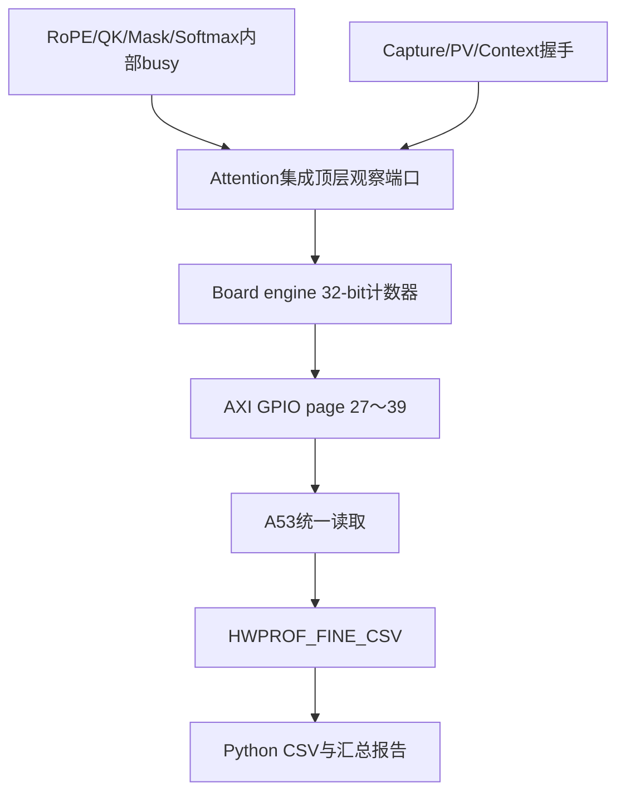

# 阶段1：细粒度性能计数器设计

版本：`v2.4-profile-counters-board-pass`  
基线：`v2.3-board-profile`

## 1. 设计原则

- 不修改 Attention 数值数据通路、Group 调度和 DDR 地址；
- page 0～26完全保留，旧v2.3软件仍可读取原有状态/计数器；
- 只增加观察端口、32-bit累加器、GPIO page和日志解析；
- 每次`command_start`清零，DONE后保持，soft reset清零；
- 当前完整运行约2.77亿周期，32-bit在150 MHz下约28.6秒才溢出，
  对1.84秒基线运行有足够余量；
- Busy、stall、overlap计数可以重叠，不能把所有行直接相加。

## 2. MMIO接口

本工程没有新增自定义AXI4-Lite从设备，而是复用现有AXI GPIO：

- 基地址：`0x80000000`
- Channel 1（offset `0x00`）：PS写控制字
- Channel 2（offset `0x08`）：PS读状态/计数器
- `gpio_control[0]`：START
- `gpio_control[1]`：CAUSAL_EN
- `gpio_control[2]`：SOFT_RESET
- `gpio_control[8:3]`：6-bit profile page

软件切换page后执行一次丢弃读，再读取有效值，最后恢复page 0。

## 3. Page表

| Page | 名称 | 计数条件/含义 |
|---:|---|---|
| 0 | STATUS | 原有busy/done/error/group/低16位总周期 |
| 1 | TOTAL_CYCLES | START后板级engine busy周期 |
| 2 | V_LOAD_CYCLES | V preload状态周期 |
| 3 | CORE_RUN_CYCLES | `S_RUN_CORE`周期 |
| 4 | RAW_WAIT_CYCLES | raw Q/K请求valid但未ready |
| 5 | RAW_BUSY_CYCLES | raw Q/K DDR reader busy |
| 6 | BC_BUSY_CYCLES | RoPE→QK→Mask→Softmax→B+C backend总busy |
| 7 | PV_BUSY_CYCLES | real TILE4 PV busy |
| 8 | CONTEXT_BUSY_CYCLES | Context DDR writer busy |
| 9 | CONTEXT_BACKPRESSURE | Context valid但writer未ready |
| 10 | DDR_READ_BUSY | 保留v2.3原定义 |
| 11 | DDR_WRITE_BUSY | 保留v2.3原定义 |
| 12～15 | Traffic | raw request、read beat、write beat、context word |
| 16～23 | GROUP0～7_CYCLES | 每个Group从开始至`group_complete` |
| 24～26 | Commands/Error | read command、write command、error bitmap |
| 27 | ROPE_BUSY_CYCLES | RoPE group bridge busy |
| 28 | QK_BUSY_CYCLES | QK systolic core busy |
| 29 | MASK_BUSY_CYCLES | causal mask + tile-to-row adapter/reorder busy |
| 30 | SOFTMAX_BUSY_CYCLES | Softmax engine busy |
| 31 | BC_BACKEND_BUSY_CYCLES | probability buffer/replay backend busy |
| 32 | CAPTURE_BUSY_CYCLES | TILE2→TILE4 Group capture/repack busy |
| 33 | CONTEXT_TRANSFER_CYCLES | `context_valid && context_ready`周期 |
| 34 | BC_PV_OVERLAP_CYCLES | B+C和real PV同时busy |
| 35 | CORE_IDLE_CYCLES | CORE_RUN内raw/计算/capture/PV/context均不busy |
| 36 | REPACK_STALL_CYCLES | B+C replay valid但repack未ready |
| 37 | PV_FEED_STALL_CYCLES | repack输出valid但real PV未ready |
| 38 | SOFTMAX_STALL_CYCLES | Softmax概率输出valid但backend未ready |
| 39 | INTERSTAGE_WAIT_CYCLES | core busy但B+C与PV均不busy |

## 4. 信号路径



## 5. 关键一致性检查

板测日志应满足：

```text
context_transfer_cycles == context_word_count == 524288
sum(group0_cycles ... group7_cycles) ≈ core_run_cycles
core_idle_cycles <= core_run_cycles
bc_pv_overlap_cycles <= min(bc_busy_cycles, pv_busy_cycles)
all stage/stall counters <= core_run_cycles
error_detail == 0
```

v2.3串行调度下，`bc_pv_overlap_cycles`应接近0。阶段2双缓冲后，该计数器
应显著增加。`core_run_cycles - core_idle_cycles`可作为“至少有一个子阶段
活动”的union周期；各独立busy会互相重叠，不能用于排他求和。

## 6. 验证顺序

1. `python python/validate_profile_contract.py`
2. Vivado Tcl Console运行：
   `source scripts/check_rtl_elaboration.tcl`
   - 生成工程位于源码相邻的`_fpt_v24_build`短目录；
   - 脚本每次重建生成工程并重写导入BD/IP的输出路径；
   - 不会引用旧`pl_read_write_ps_ddr.gen`工程。
3. 许可证恢复后运行：
   `source scripts/build_profile_foreground.tcl`
4. 记录v2.4相对v2.3的LUT/FF/BRAM/DSP增量和WNS；
5. 使用新XSA重建Vitis应用，下载新bit和新ELF；
6. 预热1次、正式10次，确认Combined failures=0；
7. 将串口日志保存为文本并运行：
   `python python/parse_v23_profile_log.py <log> --out-dir reports/profile_v2.4`

## 7. 验收标准

- RTL elaboration、综合、实现、DRC通过；
- WNS≥0、TNS=0；
- 10/10正确，Combined failures=0；
- 数值误差不劣于v2.3；
- 总延迟和主要资源增量均小于1%；
- page 0～26读数与v2.3口径一致；
- 上述一致性检查全部通过；
- 能据此确定阶段2的主要等待点和可重叠区间。

## 8. 实体板验收结果

2026-07-29 已按上述顺序完成 Vivado/Vitis 2024.2 构建和 XCZU15EG
实体板验证：

- RTL elaboration、综合、实现和 DRC：PASS；
- 150.015 MHz 时序约束满足，WNS=+1.146 ns、TNS=0；
- 预热 1 次、正式 10 次，正确与确定性均为 10/10；
- Combined failures=0，最大 BF16 距离为 1 ULP；
- 平均延迟 1843.689 ms，相对 v2.3 基本不变；
- 资源增量为 +455 LUT（+0.89%）、+92 FF（+0.25%），BRAM/DSP 不变；
- B+C / real-PV overlap=0，Real-PV feed stall=115,605,520 cycles
  （41.802%）。

全部验收条件已满足。阶段2应优先实现跨 Group B+C/PV 双缓冲并降低
Real-PV feed stall。完整证据见 `V2_4_BOARD_PASS_RECORD.md`。
