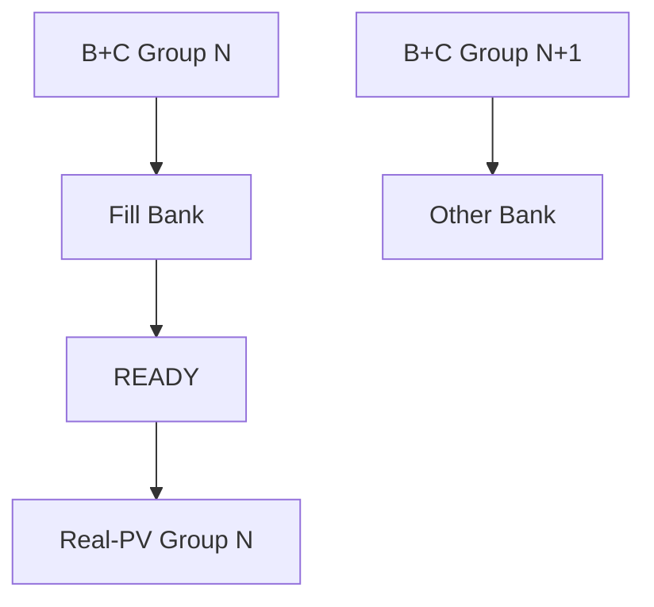

# 阶段2：v2.5跨Group Ping-Pong集成

## 1. 基线和边界

唯一基线是`v2.4-profile-counters-board-pass`：

- 8 Group、32Q/8KV、S=128、D=128、BF16；
- 10/10正确，Combined failures=0；
- 276,550,484 PL cycles，1843.689 ms，149.998 MHz；
- B+C busy占56.643%，Real-PV busy占43.319%；
- B+C/Real-PV overlap为0。

阶段2只修改跨Group调度和P/V交接存储，不修改QK、Mask、Softmax、
B+C backend或Real-PV计算核心。

## 2. v2.4为何串行

v2.4的`attention_group_pv_controller`严格执行：

```text
启动B+C
→ 捕获完整Group
→ 启动Real-PV
→ 等待Context全部完成
→ 启动下一Group
```

`pv_tile2_to_tile4_buffer_adapter`也只有一个完整Group存储区。Real-PV读取
这个存储区时，下一个Group不能覆盖它。

## 3. v2.5数据流



两个Bank的状态均为：

```text
EMPTY → FILLING → READY → DRAINING → EMPTY
```

控制器分别保存：

- `bc_launch_group_id`：下一次前端启动使用；
- `pv_active_group_id`：当前Real-PV和Context元数据使用。

Bank按照Group 0、1、2……严格顺序排空，不允许越序。

## 4. 为什么Bank同时保存P和V

v2.4的B+C输出不是单独的Softmax标量，而是TILE2 P/V向量流。保留这一
已验证边界，可以不改B+C backend，并避免Real-PV与下一Group的B+C同时
争用单端口V读取接口。

每个Bank保存：

```text
P: [4 Q heads][128 rows][128 reduce] BF16
V: [128 reduce][128 feature] BF16
```

P和V都按4个lane拆分，Real-PV一次读取4个BF16值。

## 5. 同步BRAM连续预取

v2.4单Bank适配器使用异步数组读取，综合报告显示：

```text
u_repack LUTRAM = 25,600
u_repack RAMB36 = 0
```

如果直接复制异步数组，LUTRAM会翻倍。v2.5改为同步简单双端口模板：

- 一个端口接收B+C写入；
- 一个端口为Real-PV读出；
- 第一个向量增加一次BRAM读延迟；
- 每次成功握手时预取确定的下一个`head/row/col/reduce`；
- 连续reduce beat保持每拍一个向量，不增加逐beat气泡；
- 最终向量握手后用`feed_complete`禁止重复预取。

## 6. 资源估算

按RAMB36的`2048×18`组织估算：

| 存储 | 深度/每lane | lane | RAMB36 |
|---|---:|---:|---:|
| 双Bank P | 32768×16 | 4 | 64 |
| 双Bank V | 8192×16 | 4 | 16 |
| 合计新增 |  |  | 80 |

基于v2.4的99.5 BRAM Tile：

```text
预计总BRAM = 99.5 + 80 = 179.5
占XCZU15EG 744 Tile的24.13%
```

这仍低于25%保护线，但余量只有约0.87个百分点，必须以Vivado综合报告
确认。早期`+64 RAMB36 / 21.98%`只计算了P矩阵，没有计入V，因此不能再
作为完整集成资源结论。

## 7. 已完成验证

本地小参数自检覆盖：

- 4个Group；
- TILE2输入顺序和TILE4读取顺序；
- P/V逐元素比对；
- 两Bank交替；
- 输出反压；
- Group顺序；
- 最后向量保护；
- B+C/PV overlap必须大于0。

结果：

```text
V25_PINGPONG_INTEGRATION_TEST: PASS
overlap_cycles=479
```

同时，12个受保护的v2.4 QK/Softmax/PV/B+C关键RTL文件哈希保持不变。

## 8. 本机验收

依次执行：

```bat
00_run_v25_pingpong_unit_sim.bat
01_check_v25_rtl.bat
02_build_v25_bitstream.bat
03_build_vitis_v25.bat
```

综合完成后必须检查：

- WNS≥0、TNS=0；
- DRC无Error；
- `u_repack`主要推断为RAMB36，不再是约25,600 LUTRAM；
- 总BRAM Tile<25%；
- LUT/FF/DSP无异常增长。

板测仍沿用v2.4组合正确性判据：

```text
abs_error <= 1e-4 OR BF16_distance <= 1 ULP
```

阶段2板测验收：

- 预热PASS；
- 10/10正式运行PASS；
- Combined failures=0；
- hardware error bitmap=0；
- `prof_bc_pv_overlap_cycles > 0`；
- 实测延迟和加速比相对v2.4改善。

在这些条件完成前，v2.5只能称为“已集成/待板测”，不能称为“板级通过”。
