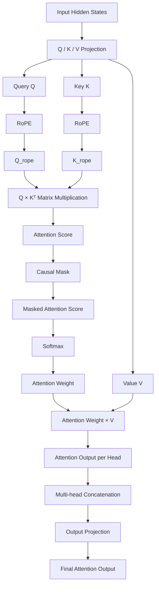
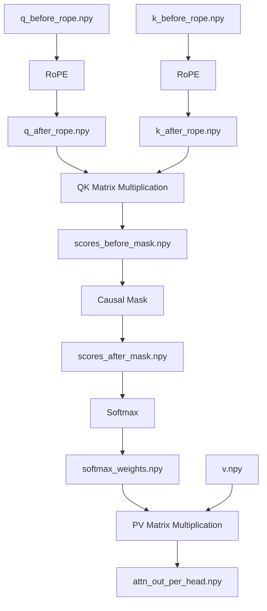
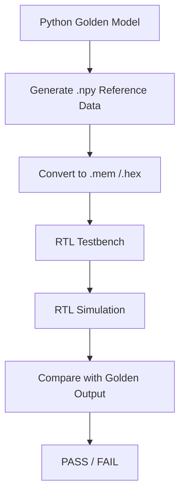

# LLaMA3-8B Attention FPGA Accelerator

## Overview

This project focuses on FPGA acceleration of the **LLaMA3-8B Transformer Attention module** with hardware optimization based on the **Grouped Query Attention (GQA)** architecture.

The project implements the complete Attention computation pipeline, including:

- Rotary Position Embedding (RoPE)
- GQA-based Query/KV Head Mapping
- QKᵀ Matrix Multiplication
- Causal Mask
- Softmax
- PV Matrix Multiplication
- Multi-head Attention Output

A Python-based Golden Model is developed to generate intermediate reference results, and RTL Testbench is used for module-level functional verification.

The main goal is to explore efficient FPGA architectures for Large Language Model inference by optimizing:

- GQA data mapping
- Multi-head parallel computation
- Memory access efficiency
- FPGA resource utilization


---

# 1. Overall Attention Architecture

The complete LLaMA3 Attention computation flow is:



# 2. Grouped Query Attention (GQA)

LLaMA3-8B uses **Grouped Query Attention (GQA)** instead of traditional Multi-Head Attention.

## Traditional Multi-Head Attention

Each Query head has independent Key and Value heads:
Q1 K1 V1
Q2 K2 V2
...
Q32 K32 V32


## LLaMA3 GQA Architecture

The configuration is:
Query Heads : 32

KV Heads : 8


Therefore:


Group Size = 32 / 8 = 4


Each KV head is shared by four Query heads.

Mapping relationship:


Q0 Q1 Q2 Q3 --> KV0

Q4 Q5 Q6 Q7 --> KV1

Q8 Q9 Q10 Q11 --> KV2

...

Q28 Q29 Q30 Q31 --> KV7


In hardware implementation, GQA is optimized through address mapping instead of duplicating KV data, reducing memory bandwidth requirements.


---

# 3. Attention Module Implementation


## 3.1 RoPE (Rotary Position Embedding)

### Function

RoPE introduces positional information into Query and Key vectors through rotary transformation.

### Input


q_before_rope.npy

k_before_rope.npy


### Output


q_after_rope.npy

k_after_rope.npy


---

## 3.2 QKᵀ Matrix Multiplication


### Function

Calculate attention similarity:


Attention Score = Q × Kᵀ / sqrt(d)


### Input


q_after_rope.npy

k_after_rope.npy


### Output


scores_before_mask.npy


The output represents the raw attention score matrix before masking.


---

## 3.3 Causal Mask


### Function

Causal Mask prevents each token from accessing future tokens.

Before Mask:


1 1 1 1
1 1 1 1
1 1 1 1
1 1 1 1


After Mask:


1 -inf -inf -inf

1 1 -inf -inf

1 1 1 -inf

1 1 1 1


### Input


scores_before_mask.npy


### Output


scores_after_mask.npy


---

## 3.4 Softmax


### Function

Convert attention scores into normalized probability weights:


Attention Weight = Softmax(Score)


### Input


scores_after_mask.npy


### Output


softmax_weights.npy


---

## 3.5 PV Matrix Multiplication


### Function

Generate attention output:


Attention Output = Softmax(QKᵀ) × V


### Input


softmax_weights.npy

v.npy


### Output


attn_out_per_head.npy


---

## 4. Golden Model Data Flow


# 5. Golden Model File Mapping


| Module | Input Files | Output Files | Description |
|---|---|---|---|
| RoPE | `q_before_rope.npy`<br>`k_before_rope.npy` | `q_after_rope.npy`<br>`k_after_rope.npy` | Rotary position encoding |
| GQA Mapping | `q_after_rope.npy`<br>`k_after_rope.npy`<br>`v.npy` | KV head mapping result | Map 32 Query Heads to 8 KV Heads |
| QK Matrix Multiplication | `q_after_rope.npy`<br>`k_after_rope.npy` | `scores_before_mask.npy` | Generate attention score |
| Causal Mask | `scores_before_mask.npy` | `scores_after_mask.npy` | Apply causal constraint |
| Softmax | `scores_after_mask.npy` | `softmax_weights.npy` | Generate attention probability |
| PV Matrix Multiplication | `softmax_weights.npy`<br>`v.npy` | `attn_out_per_head.npy` | Generate attention output |
| Multi-head Merge | `attn_out_per_head.npy` | Concatenated output | Combine all heads |
| Output Projection | Concatenated output | `final_output.npy` | Generate final Attention output |


---

## 6. FPGA Verification Flow




Comparison metrics:

- Maximum Absolute Error
- Mean Absolute Error
- Error Count


---

# 7. Current Progress


## Completed

- [x] LLaMA3-8B Attention Golden Model
- [x] RoPE computation
- [x] QKᵀ Matrix Multiplication
- [x] Causal Mask
- [x] Softmax
- [x] PV Matrix Multiplication
- [x] Intermediate result generation


## Future Work

- [ ] FPGA RTL implementation
- [ ] GQA hardware scheduler
- [ ] Multi-head parallel accelerator
- [ ] Memory optimization
- [ ] Full Attention pipeline integration


---

## 8. Project Structure

```text
Llama3-8B-Attention-Optimize
├── README.md
├── .gitignore
├── scripts
│   ├── llama3_attention_golden_model.py
│   └── data_convert.py
│
├── golden_model_outputs
│   ├── full
│   └── fpga_slice
│
├── rtl
│   ├── rope
│   ├── qk_matmul
│   ├── softmax
│   └── pv_matmul
│
└── testbench
```


---

# License

This project is for research and educational purposes.
