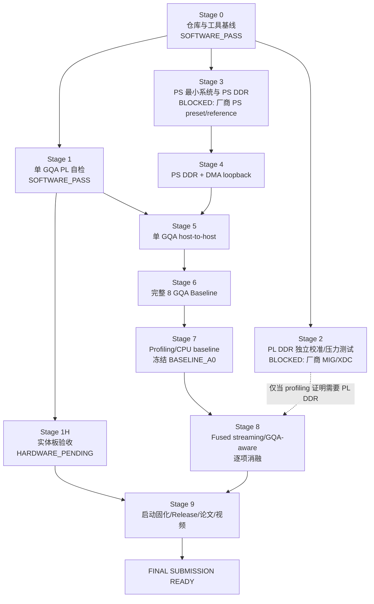

# RK-XCZU15EG-F FPT'26 总执行计划

状态日期：2026-07-26

执行分支：`rk-xczu15eg-final-system`

冻结基线：`rk-xczu15eg-pl-selftest` @ `83073ae`

目标器件：`xczu15eg-ffvb1156-2-i`

工具：Vivado / Vitis 2025.2

## 1. 当前可信结论

当前项目已完成 RK-XCZU15EG-F 的 Stage 0 和 Stage 1 软件侧流程。Stage 1
的行为仿真、restart 回归、综合、实现、时序、DRC、bitstream 和 LTX 均有
本地证据。实体板未在本执行环境中连接，所以状态必须写为：

```text
Stage 1 software status: SOFTWARE_PASS
Stage 1 hardware gate:   HARDWARE_PENDING
Overall Stage 1 status:  HARDWARE_PENDING
```

这不是完整系统。当前输入来自片上 golden ROM，只运行一个 GQA group，
没有 PS、DDR、DMA、8 GQA、host-to-host 闭环或脱机启动。

### Stage 1 已核对证据

| 项目 | 核对结果 |
|---|---|
| 源码/构建提交 | `5a128c8` |
| manifest 文档提交 | `83073ae` |
| 配置 | 1 GQA，4 Q heads，共享 1 K/V head，`SEQ_LEN=128`，`HEAD_DIM=128`，BF16 |
| 数据通路 | RoPE → QK → Scale/Mask → Softmax → PV → Context |
| 仿真 | 两次完整运行，65,536 Context words/run，mismatch 0 |
| 周期 | 16,170,681 cycles，100 MHz 下 161.70681 ms |
| 实现 | LUT 68,231；FF 35,129；BRAM 89.5；URAM 0；DSP 136 |
| 时序 | WNS `+2.221 ns`；WHS `+0.011 ns` |
| bitstream | 28,700,902 bytes；SHA-256 `92856247B6AE241B762683537636CF76BF58405C0B4D0B9AEA688C9EA1104D90` |
| LTX | 31,229 bytes；SHA-256 `646C76E45C14F294479AB94FB9AA08F9781B48AA8BD165AE170A60C9D8B3EF40` |
| 实体板 | 尚未执行，不能标记 `HARDWARE_PASS` |

完整 Stage 1 构建耗时很长。本轮未重跑，因为报告、源码、manifest 和本地
制品 SHA-256 相互一致，未发现触发回归的矛盾。

## 2. 状态词与证据边界

阶段状态只允许：

```text
NOT_STARTED
IN_PROGRESS
SOFTWARE_PASS
HARDWARE_PENDING
HARDWARE_PASS
BLOCKED
FAILED
```

- `SOFTWARE_PASS`：仿真、静态检查或构建已经实际执行并满足该阶段的软件验收。
- `HARDWARE_PENDING`：已具备上板输入，但尚无实体板证据。
- `HARDWARE_PASS`：实体板按该阶段验收矩阵实际运行并留存证据。
- `BLOCKED`：缺少不可猜测的外部板级资料、设备或授权。
- 文档生成、静态审计和 Vivado 实现通过不得写成实体板通过。

## 3. 阶段依赖图



Stage 2 与 Stage 3 的资料核对、接口规范和测试规划可以并行。Stage 4 必须
等待 Stage 3；Stage 5 必须等待 Stage 4；Stage 6 必须等待 Stage 5；
Stage 8 必须以 Stage 7 冻结的 `BASELINE_A0` 为起点。Stage 2 不应因“板上
有 PL DDR”而被强行放入最终关键路径，是否使用由 Stage 7 profiling 决定。

## 4. 阶段执行矩阵

| 阶段 | 当前状态 | 主要输入 | 验收门 | 固定输出 |
|---|---|---|---|---|
| 0 仓库基线 | `SOFTWARE_PASS` | 原仓库、Vivado 2025.2 | 隔离 worktree、器件/IP 可见 | `reports/00_repo_baseline/` |
| 1 PL 单 GQA | `HARDWARE_PENDING`（软件为 `SOFTWARE_PASS`） | RTL、golden、时钟 XDC | 仿真/实现/bitstream PASS | `reports/10..12`、bit/LTX |
| 1H 实体板验收 | `HARDWARE_PENDING` | 匹配 bit/LTX、RK 板、JTAG | 100 次 restart 零失败；多次下载；建议 5 次冷启动 | `reports/13_rk_pl_selftest_hardware/` |
| 2 PL DDR | `BLOCKED` | 厂商 MIG/XDC/reference | 冷启动校准稳定、压力测试零错误 | `reports/20_*`、`21_*` |
| 3 PS/PS DDR | `BLOCKED` | 厂商 PS preset/reference | UART、PS DDR、cache on/off、XSA 可重建 | `reports/30_*`、`31_*` |
| 4 DMA loopback | `NOT_STARTED` | Stage 3 hardware pass | 多长度逐字节一致、无 cache/DMA error | `reports/40_dma_loopback/` |
| 5 单 GQA H2H | `NOT_STARTED` | Stage 1 + Stage 4 | 真实 DMA Q/K/V、Golden PASS、三层延迟 | `reports/50_single_gqa_dma/` |
| 6 完整 8 GQA | `NOT_STARTED` | Stage 5 | 32 Q heads 全覆盖、8 组正确、无死锁/越界 | `reports/60_multi_gqa_8/` |
| 7 Baseline | `NOT_STARTED` | Stage 6 | correctness/performance/PPA/CPU 数据齐全 | `results/baseline_a0.csv` 等 |
| 8 优化与消融 | `NOT_STARTED` | 冻结 `BASELINE_A0` | A1–A7 每次仅变一个主变量并对拍 | `results/optimized/`、`ablation/` |
| 9 最终交付 | `NOT_STARTED` | 硬件、baseline、优化证据 | clean clone 重建、上板、启动、论文/视频 | `release/` |

## 5. 每阶段强制目录契约

每个阶段目录必须包含：

```text
status.json
build.log
summary.md
reports/
artifacts/
```

约束如下：

1. `status.json` 使用允许状态词，保存依赖、提交、工具、器件、时间和下一动作。
2. `build.log` 只保存可复现入口和关键结果，不把巨量 Vivado 原文提交到普通 Git。
3. `summary.md` 必须区分静态检查、仿真、实现和实体板证据。
4. 大型 bit/LTX/XSA 由 manifest、SHA-256、Release/LFS 或制品库管理。
5. 阶段通过后创建一个本地逻辑提交，并在进入下一阶段前更新
   `EXECUTION_STATE.json`。
6. 恢复工作时先读 `EXECUTION_STATE.json` 和最近阶段的 `summary.md`。

现有 `reports/13_rk_pl_selftest_hardware/` 只有 pending summary；其
`status.json`、`build.log`、`run_log.csv`、`reports/`、`artifacts/` 和
`screenshots/` 应在正式进入 Stage 1H 时补齐。

## 6. `first_error_index` 审计

结论：`131071` 是设计定义的无错误哨兵，不是异常值。

- RTL：`attention_pl_selftest_core.sv` 定义
  `localparam logic [16:0] NO_ERROR_INDEX = 17'h1ffff;`
- reset/restart：`first_error_index` 置为 `NO_ERROR_INDEX`。
- mismatch：仅当第一次比较失败时写入 `compared_count`。
- testbench：同样定义 `17'h1ffff`，每次完成都显式断言。
- 仿真脚本：只有 `first_error_index == 131071` 才判 PASS。

因为 `CONTEXT_WORDS=65536`，合法元素下标为 `0..65535`，17 位全 1
`0x1FFFF` 不会与合法下标冲突。无需 RTL 修改。

## 7. Stage 2/3 厂商资料盘点

盘点位置：
`<repo_root>\references`

### 已有

| 文件 | 用途 | 可直接生成板级配置 |
|---|---|---|
| `RK-XCZU15EG-F V1.0 开发板用户手册.pdf` | 板级接口、启动说明参考 | 否 |
| `XCZU15EG-F V1.0原理图.pdf` | 底板连线参考 | 否 |
| `XCZU15EG_CORE V1.0原理图.pdf` | 核心板、DDR/时钟连线参考 | 否 |
| `RK_15EG_FPGA.pdf` | 厂商教程/示例参考 | 否 |
| `MT40A512M16LY-062E.pdf` | 实际 DDR 器件数据手册 | 否 |
| 两份项目规划 Markdown | 迁移与执行背景 | 否 |

### 缺失且不得猜测

Stage 2 需要但未找到：

- 板卡 V1.0 Master XDC；
- 已验证 PL DDR4 MIG `.xci` 或等价 Tcl；
- 厂商 Vivado reference project；
- PL DDR memory test；
- 板卡版本匹配的 MIG 参数说明。

Stage 3 需要但未找到：

- Zynq UltraScale+ PS preset 或厂商 reference project；
- PS DDR 配置和 MIO 分配；
- UART、JTAG、SD/eMMC、QSPI、boot mode 的可导入配置；
- XSA/BSP、FSBL、PMUFW、BIF/device tree 或出厂源码。

PDF 可用于交叉核对，但不能替代经过厂商验证的 XDC、MIG 或 PS preset。特别是
板上实际 DDR 为 `MT40A512M16LY-062E`，教程截图使用的
`MT40A512M16HA-083E` 不得照抄。

## 8. 任务分类

### 现在可立即执行

- 维护总控状态、接口/寄存器/数据帧规范和测试矩阵。
- 为 Stage 1H 准备 100-run 记录模板和证据清单。
- 静态设计 Stage 3/4 的 Block Design 结构与 bare-metal 测试接口。
- 设计 Stage 5 production wrapper，不删除原 ROM self-test。
- 统一 Python、软件、RTL 的 shape/metadata 配置格式。
- 准备 kernel/transaction/application 三层计时寄存器定义。
- 准备 full 8 GQA golden、地址映射和 scheduler 验证计划。
- 向厂家索取 Stage 2/3 的机器可导入资料。

这些工作只能标为文档/静态准备，不能标为相应硬件阶段通过。

### 必须人工上板

- 电源、散热、拨码/JTAG 连接和 Program Device。
- Stage 1H 的 100 次 restart、多次重新下载、建议 5 次冷启动。
- VIO/ILA、cycle count、温度/风扇、板卡照片和截图留证。
- Stage 2 DDR calibration/压力测试。
- Stage 3 UART、PS DDR、cache on/off。
- Stage 4–6 DMA/Attention host-to-host。
- Stage 9 脱机启动与实机视频。

### 外部资料阻塞

- Stage 2 的 MIG/XDC/reference/memory-test。
- Stage 3 的 PS preset/reference/PS DDR/MIO/boot 配置。
- 资料公开分发许可，决定厂商文件能否进入 GitHub。

### 可并行

- Stage 1H 人工上板与 Stage 2/3 资料索取。
- Stage 2 memory-test 方案与 Stage 3 bare-metal 软件框架准备。
- Stage 5 流协议/寄存器规范与 full 8 GQA golden/验证准备。
- 比赛测量模板、论文图表字段和 clean-clone 规则准备。

## 9. 最短可提交路径（P0）

优先目标是先完成正确、可测、可复现的 8 GQA 系统，不让可选 PL DDR 阻塞：

```text
Stage 1H 实体板证明
→ Stage 3 厂商 PS preset + PS DDR
→ Stage 4 AXI DMA loopback
→ Stage 5 单 GQA host-to-host
→ Stage 6 8 GQA 顺序 baseline
→ Stage 7 三层延迟/AXI/PPA/CPU baseline
→ Stage 8 至少 A1/A2/A3 的一项实质优化与消融
→ Stage 9 JTAG 或 SD/eMMC 可复现交付
```

如果 Stage 2 资料持续缺失，最终 baseline 先使用 PS DDR。PL DDR 明确标为
optional/blocked，不允许虚构支持，也不允许阻塞 PS DDR + DMA 路径。

## 10. 完整优化路径

在 `BASELINE_A0` 冻结后按单变量提交：

1. A1：Tiled QK/PV，缩小或移除完整 TILE2→TILE4 捕获/重排。
2. A2：Scale + causal mask + online Softmax + streaming PV 融合，
   不落完整 Score/P。
3. A3：GQA-aware K/V broadcast，一份 K/V tile 服务 4 个 Q heads。
4. A4：DMA ping/pong，重叠 LOAD/COMPUTE/STORE。
5. A5：causal tile skip，整块跳过未来 token。
6. A6：1/2/4 GQA cluster 扫描。
7. A7：100/150/200 MHz 扫描。
8. 可选：INT8 KV、prefill/decode 双模式、paged KV cache；必须独立报告精度。

所有 variant 使用相同输入、shape、correctness threshold、板卡、DMA 边界和测量
脚本；频率消融之外保持相同时钟。

## 11. 本轮停止门

本轮只完成审计与总控文件，不启动 Stage 2/3 工程。下一轮必须由用户明确选择：

- `Stage 1H`：需要实体板与人工操作；
- `Stage 2`：先补厂商 MIG/XDC，未补齐时只能做 blocked/preparation；
- `Stage 3`：先补厂商 PS preset/reference，未补齐时只能做 blocked/preparation。

推荐优先选择 Stage 1H；同时向厂家索取 Stage 2/3 机器可导入资料。
